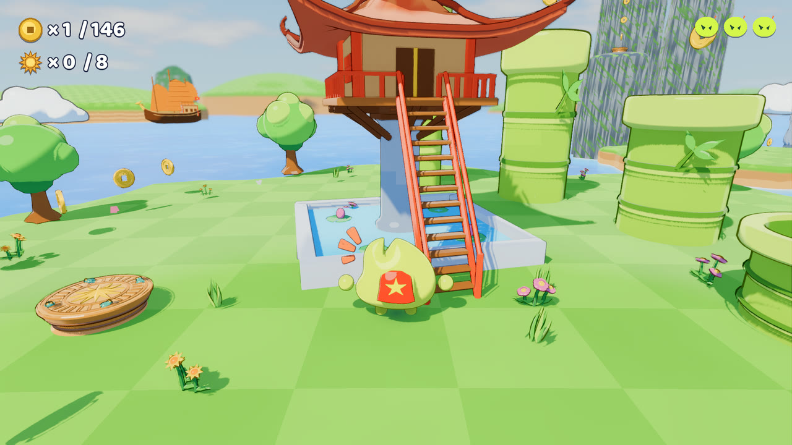
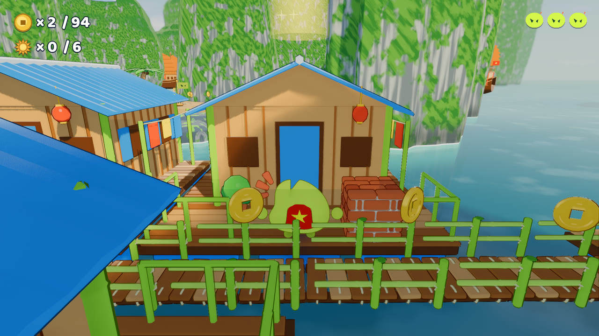
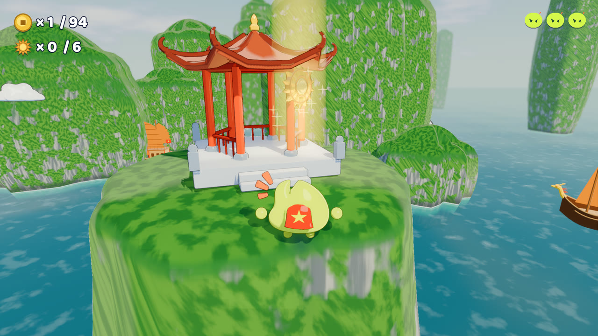
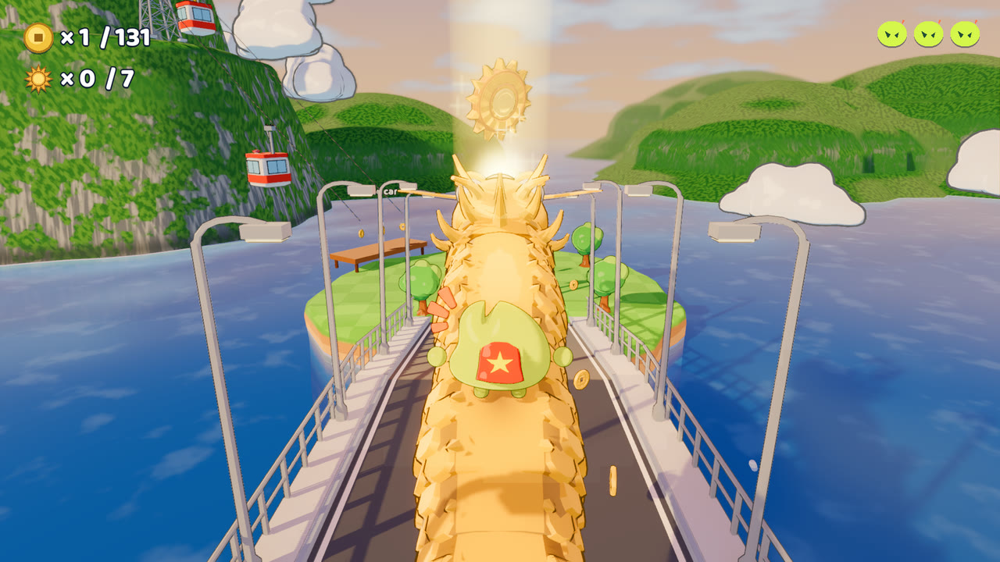
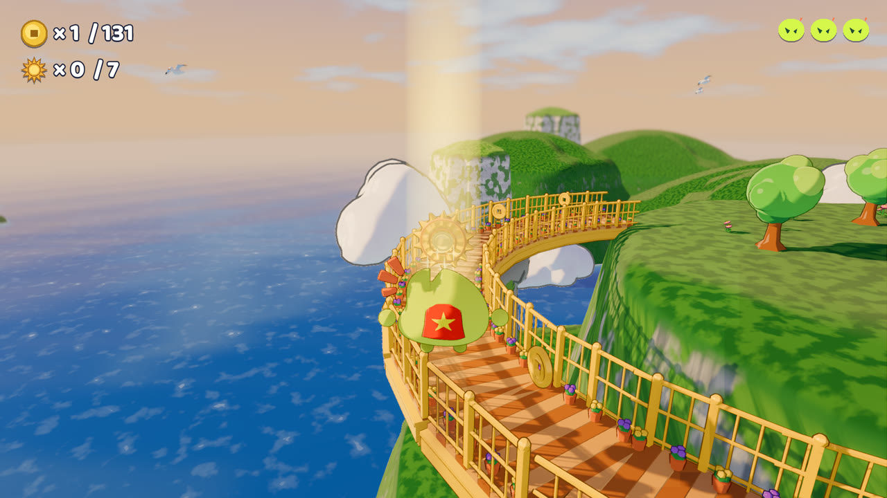
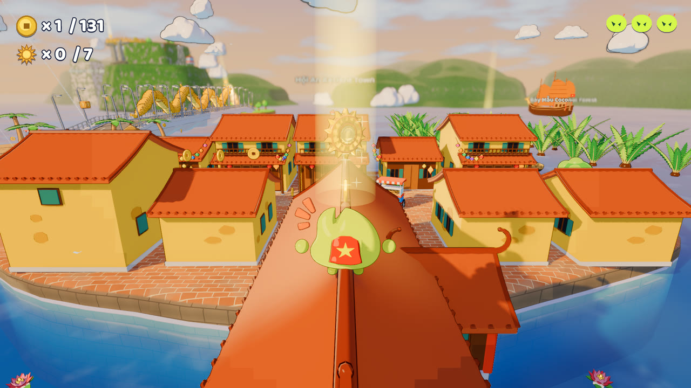

# Little Giant: Star Hop

A Mario-64-style 3D platformer for iPhone, built with **React Native**. The VGANG mascot
**Little Giant**, in a Vietnamese flag cape, hops across three maps of Vietnam collecting bronze
Đông Sơn stars.

It runs on iPhone and on the foldable iPhone Duo, folded or unfolded.


| | |
|---|---|
|  |  |
|  |  |
|  |  |

## The maps

Junk boats moored on each shore sail between the maps, and the pause menu can take you to any
of them.

- **Hạ Long Skies:** floating islands, rice terraces, limestone karsts and a lotus lagoon.
  It has 8 stars and 146 coins. Find every star and the great bronze drum rings out for
  **ALL STARS!**
- **Vịnh Hạ Long (Hạ Long Bay):** an emerald bay of limestone towers, with a floating fishing
  village and Surprise Cave. A dragon circles the bay, and you can ride on its back. It has
  6 stars and 8 dragon pearls.
- **Đà Nẵng – Hội An:** the central coast at golden hour. It has 7 stars, 8 hoa đăng flower
  lanterns and 131 coins.
  - The golden Dragon Bridge breathes fire, then water.
  - The Bà Nà cable car climbs to the Golden Bridge, held up by two stone hands.
  - You can climb the Marble Mountains.
  - Hội An has a lantern street and Chùa Cầu (the Japanese Covered Bridge).
  - Basket boats spin in the coconut forest.

## Controls

| | |
|---|---|
| Move | Floating stick under the left thumb; push further to run |
| Jump | Big lime button. Tap again in the air to double jump; jump as you land to go higher |
| Dash | Orange button, also in the air |
| Ground pound | Yellow button, in the air |
| Wall kick | Jump while sliding down a wall |
| Camera | Drag the right half of the screen; buttons to recenter and zoom |
| Pause | Pause button: stars, settings, English / Tiếng Việt, sail to another map |

Spring drums launch you, and ground-pounding one gives a super bounce. Bonk "?" drum blocks for
coins and stomp the crabs. Every 50 coins restores a health pebble.

## How it's built

React Native owns the app. The 3D game runs inside it as a native view.

| Library | What it does here |
|---|---|
| [`@borndotcom/react-native-godot`](https://github.com/borndotcom/react-native-godot) | Embeds the 3D engine (LibGodot, Metal) as a React Native view on its own thread |
| [`react-native-worklets-core`](https://github.com/margelo/react-native-worklets-core) | Bridges the game thread and JS: the game reports its state and asks for haptics (`mobile/src/gameBridge.ts`) |
| [`@shopify/react-native-skia`](https://github.com/Shopify/react-native-skia) | Draws the splash and loading screen: a Hạ Long sky, a turning Đông Sơn sun and the mascot hopping on an island (`mobile/src/Curtain.tsx`) |
| [`react-native-reanimated`](https://github.com/software-mansion/react-native-reanimated) + [`react-native-worklets`](https://github.com/software-mansion/react-native-worklets) | Animates the splash and the Mario-64 iris that opens onto the game and closes over map changes |
| [`expo-haptics`](https://docs.expo.dev/versions/latest/sdk/haptics/) | The iOS haptic engine: buttons, ground pounds, stars and getting hurt |
| [`expo-file-system`](https://docs.expo.dev/versions/latest/sdk/filesystem/) | On-device touch tests |

**What the app handles around the game:**
- The splash stays up until the game has drawn its first frames.
- Leaving the app (home, a call, Control Center) opens the pause menu and halts the engine.
- The game is landscape only, the home indicator fades out, and edge swipes reach the game first.
- The layout follows the iPhone Duo as it folds and unfolds, and the HUD stays clear of its front
  camera.

The mascot and every prop are modelled, rigged and animated in **Blender**.

## Run it

You need macOS with Xcode 27 and Node 18+.

```sh
cd mobile
npm install --legacy-peer-deps
npx download-prebuilt     # fetches the engine's iOS xcframeworks
cd ios && pod install && cd ..
./build_ios_sim.sh <simulator-udid>
```

**What the build needs:**
- `build_ios_sim.sh` packs the game into `ios/LittleGiant64.pck`, builds the Release app and
  launches it on the simulator.
- Packing needs the engine's 4.5.1 command-line exporter. Get it from the
  [4.5.1 release](https://github.com/godotengine/godot/releases/tag/4.5.1-stable), then point
  `GODOT_EDITOR` at it or put it in `~/Applications/godot-4.5.1/`.

**On a real iPhone:** open `ios/LittleGiant64.xcworkspace`, choose your own team under
*Signing & Capabilities*, and change the bundle id to one you own.

See [mobile/README.md](mobile/README.md) for the version pins, the iOS 27 fixes and on-device
touch testing.

## Project layout

```
mobile/      the React Native app (App.tsx, src/, ios/)
scripts/     game logic: player, camera, levels, touch controls, HUD
shaders/     toon light, ink outlines, sea with shore foam, sky
assets/      models, audio, fonts and CREDITS.md
blender/     Python generators for the mascot and props
```

## License

- **Code** is [MIT](LICENSE).
- **The Little Giant mascot and the VGANG brand** are © VGANG Studio, all rights reserved. That
  covers the character itself and every file that depicts it:
  - `blender/common/mascot_artwork.json`
  - `blender/mascot/mascot.blend` and `blender/mascot/renders/`
  - `assets/models/mascot.glb`, `icon.png`, `mobile/assets/hero.png` and the app icon

  The Python scripts in `blender/mascot/` are MIT like the rest of the code. Please don't reuse the
  mascot in your own projects.
- **Music, sound effects and fonts** keep their original licences (CC0, CC BY and SIL OFL); see
  [assets/CREDITS.md](assets/CREDITS.md). Music by Kevin MacLeod; sound effects by Kenney and
  Juhani Junkala.

---
Made with ♥ by VG TEAM
