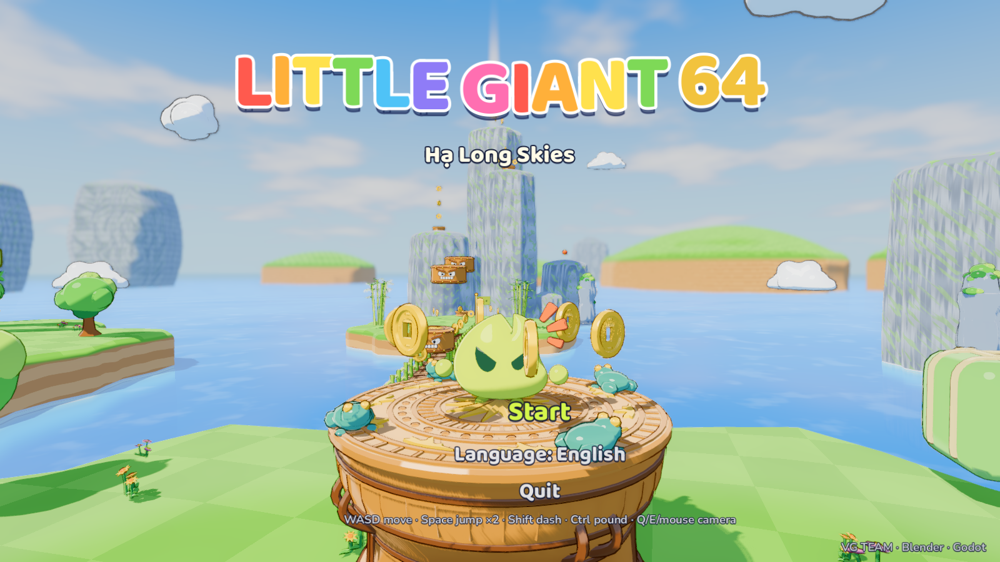

# Little Giant: Star Hop

A Super-Mario-64-style 3D island platformer starring the VGANG **Little Giant**, who wears a
Vietnamese flag cape. The mascot is
modelled, rigged and animated in **Blender 5.2** from the approved brand vectors. The game runs in
**Godot 4.7** (Forward+).

There are three levels, linked by junk boats moored on their shores. You can also sail to any
level from the pause menu.

It also runs on iPhone inside a React Native app, with touch controls, haptics and a Skia +
Reanimated splash: see [mobile/README.md](mobile/README.md).

- **Hạ Long Skies** has floating islands, rice terraces, limestone karsts and a lotus lagoon. It
  has 8 bronze Đông Sơn stars and 146 coins. Collect every star and the great bronze drum rings
  out for **ALL STARS!**
- **Vịnh Hạ Long (Hạ Long Bay)** is an emerald bay full of limestone towers with a floating fishing
  village and Surprise Cave. A dragon circles the whole bay, and you can ride on its back. It has
  6 stars and 8 dragon pearls.
- **Đà Nẵng – Hội An** is the central coast at golden hour, with 7 stars, 8 hoa đăng flower lanterns
  and 131 coins:
  - Mỹ Khê beach is home.
  - Dragon Bridge's golden dragon arches over the Hàn river, breathing fire, then water.
  - The Bà Nà cable car climbs to the Golden Bridge, held up by two giant stone hands.
  - The Marble Mountains rise to the west.
  - Lantern-lit Hội An and the Japanese Covered Bridge lie south-east.
  - Basket boats spin in the Bảy Mẫu coconut forest.



## Play

```bash
godot --path .            # or open project.godot in Godot 4.7.2 and press F5
```

| | Keyboard / mouse | Gamepad |
|---|---|---|
| Move | WASD / arrows (Alt = walk) | Left stick |
| Jump / double jump | Space (tap twice; jump again on landing for a higher jump, a third time for a flip) | A |
| Dash (also in the air) | Shift / J | X / RB |
| Ground pound (in the air) | Ctrl / C / K | B / LB / LT |
| Wall kick | Jump while sliding down a wall | |
| Camera | Mouse (click to capture), Q/E 45° turns, Z zoom, Tab recenter | Right stick, Y zoom |
| Pause (stars, settings, EN/VI) | Esc / P | Start |

Spring drums launch you, and ground-pounding onto one gives a super bounce. Brick blocks break
when you bonk them or pound them. Drum "?" blocks pay out coins. Stomp crabs, but don't stand
under the crushers. Falling in the sea costs one health pebble and puts you back on safe ground.
Every 50 coins restores one pebble.

### The eight stars

| | Star | Where |
|---|---|---|
| 1 | Top of the Rice Terraces | Climb the six paddy tiers east of home |
| 2 | Eight Red Lanterns | Find all 8 lanterns; the star appears at the pagoda pond |
| 3 | Roof of the One Pillar Pagoda | Bamboo pipes up to the golden lotus crown |
| 4 | Karst Summit | Chain the spring drums up three limestone towers |
| 5 | Across the Lotus Lagoon | Sinking lotus leaves, a ferry, jelly bánh chưng blocks |
| 6 | Behind the Waterfall | Walk through the falls north-east |
| 7 | King of Crab Beach | Stomp all five crabs |
| 8 | A Hundred Đồng Xu | Collect 100 coins |

### Hạ Long Bay stars

| | Star | Where |
|---|---|---|
| 1 | Fishing Village Rooftops | Walk the boardwalk, climb the crate onto the last north roof |
| 2 | Heart of Surprise Cave | Climb the stalagmite pillars to the ledge at the back |
| 3 | Fighting Cock Rocks | Wall-kick up between Hòn Trống and Hòn Mái |
| 4 | Ti Tốp Summit | Ride the dragon up and jump off onto the pavilion |
| 5 | Star on the Dragon's Head | Board at the "Dragon stop" jetty, then run up its back |
| 6 | Eight Dragon Pearls | One is on the dragon, one rides the junk ferry; the star appears at the pier |

### Đà Nẵng – Hội An stars

| | Star | Where |
|---|---|---|
| 1 | Head of the Golden Dragon | Climb onto Dragon Bridge's tail and run along the humps to the head |
| 2 | Golden Bridge in the Clouds | Ride the Bà Nà cable car up, then walk out between the stone hands |
| 3 | Top of the Marble Mountains | Seven marble ledges spiral up Thủy Sơn to the stupa |
| 4 | Roof of the Japanese Bridge | From a crate onto a shophouse roof, then across to Chùa Cầu's ridge |
| 5 | Basket Boat Spin | Hop six spinning thúng chai to the coconut islet |
| 6 | Eight Flower Lanterns | Find all 8 hoa đăng (one on a cable car, one on a lantern boat, one in a basket boat…); the star appears on An Hội |
| 7 | A Hundred Coins by the Sea | Collect 100 coins |

## How it's made

```
blender/          Python generators for every model (.blend sources are rebuilt from them)
  mascot/         build_mascot.py + mascot_anims.py → assets/models/mascot.glb
  props/          build_props.py (+ modules) → assets/models/props/*.glb (66 props over three levels)
  common/         brand SVG paths (mascot_artwork.json) and the SVG parser
assets/           glTF models, Ogg audio, fonts, CREDITS.md
scripts/
  autoload/       Game (state, save, input map, CLI flags), Sound, Fx (toon materials + VFX)
  player/         Player (controller state machine), PlayerModel (anims, spring bones, squash)
  camera/         GameCamera: SM64-style follow cam
  world/          World (Hạ Long Skies), HalongWorld (Hạ Long Bay) and DanangWorld (Đà Nẵng – Hội
                  An), all built in code; Island (procedural @tool islands, karsts, marble peaks,
                  paved streets), CaveDome (a hollow cave), AmbientLife (gulls, butterflies, leaping
                  fish, kites, far sails), Props
  objects/        coins, stars, blocks, spring drums, flags, crabs, crushers, boats, lotus, jelly,
                  basket boats, the Dragon Bridge's fire…
  ui/             HUD, title, pause, rainbow headlines
  qa/bot.gd       plays every star route with real inputs
shaders/          toon light, ink outline, island ground, sea with shore foam, sky, FX
```

- **Mascot:** the brand silhouette is balloon-inflated into a pebble, with raised gang eyes, the three
  rays, detached hand and foot nubs, and a small hero cape. It has 25 bones: root, hips, spine,
  head, eyes, 3×2 ray chains, hands, feet and a 3×3 cape grid. It has 17 clips: idle, idle_look,
  walk, run, jump, double_jump (a flip), fall, land, dash, ground_pound, ground_pound_land,
  wall_slide, hurt, star_get, dance, wave and sleep. In Godot, a `SpringBoneSimulator3D` makes the
  rays and the cape trail and bounce.
- **Look:** a toon light model with cool-tinted shadows, a spec dot and a rim; inverted-hull ink
  outlines; world-space checkered grass with striped soil; and a sea shaded by real water depth with
  foam rings round every shore. Trees, palms, bamboo, grass and flowers sway in the wind, a
  per-prop vertex push shared by the toon and outline shaders (`shaders/wind.gdshaderinc`). It also uses AgX tonemapping, glow, SSAO, depth fog and far
  depth-of-field.
- **Audio:** everything is sampled, from Kevin MacLeod, Juhani Junkala, Kenney and CC0 field
  recordings. See [assets/CREDITS.md](assets/CREDITS.md).

### Rebuild the Blender assets

```bash
blender -b --factory-startup --python-exit-code 1 -P blender/mascot/build_mascot.py
blender -b --factory-startup --python-exit-code 1 -P blender/props/build_props.py -- --render
godot --headless --path . --import      # REQUIRED: a running game reads the old cached import otherwise
```

## QA

```bash
# every star route, played by the bot with real inputs (fast: fixed timestep)
godot --headless --path . --fixed-fps 60 -- --bot=all
godot --headless --path . --fixed-fps 60 -- --bot=karst --trace     # one route, with a state trace
godot --headless --path . --fixed-fps 60 -- --level=halong --bot=hl_village,hl_cave,hl_trongmai,hl_dragon,hl_titop,hl_pearls
godot --headless --path . --fixed-fps 60 -- --level=danang --bot=dn_dragon,dn_goldenbridge,dn_marble,dn_chuacau,dn_basket,dn_lanterns,dn_coins

godot --path . -- --tour=/tmp/tour                  # screenshots of every area
godot --path . -- --start --warp=pagoda             # jump straight to a star (ids in Game.STARS)
godot --path . -- --start --all-stars --warp=51.5,11.6,-13   # 7 stars owned: grab the last for the finale
godot --path . -- --start --shot=3:/tmp/a.png --quit-after-shot
godot --path . -- --start --fps                     # prints fps, draw calls and primitives
```

Test runs (`--bot`, `--warp`, `--god`, `--tour`, `--shot`) never write the save file.

```bash
godot --path . -- --touch                    # the phone controls on desktop (the mouse acts as a finger)
godot --path . --resolution 1400x986 -- --touch-qa --quit   # plays the touch controls itself: PASS/FAIL per control
godot --path . --resolution 1400x986 -- --touch-qa --touch-qa-travel --phone   # …then sails on through all three levels
godot --path . -- --level=danang --start --paused   # opens the pause menu (layout checks)
godot --path . -- --debug-hurt                      # prints where and why every health pebble is lost
```

## Trailers

```bash
tools/record_trailer.sh            # the ~60 s two-map trailer, 2560x1440
tools/record_trailer.sh danang     # the ~30 s Đà Nẵng – Hội An trailer in an iPhone Duo frame (needs numpy + Pillow)
```

Every shot is real gameplay recorded with Movie Maker; see [docs/TRAILER.md](docs/TRAILER.md).

## Export

`export_presets.cfg` has a universal macOS preset (`build/macos/LittleGiant64.zip`):

```bash
mkdir -p build/macos && godot --headless --path . --export-release macOS build/macos/LittleGiant64.zip
```

Forward+ has no web export. Switching the renderer to Compatibility would allow one, but the sea
foam needs the depth texture.

---
Made with ♥ by VG TEAM · Blender · Godot
